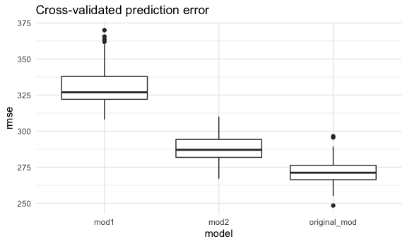

p8105\_hw6\_fl2569
================
Fang Liu
12/4/2021

Load the required packages.

``` r
library(tidyverse)
library(modelr)

knitr::opts_chunk$set(
  fig.width = 6,
  fig.asp = 0.6,
  out.width = "90%"
)

theme_set(theme_minimal())
options(
  ggplot2.continuous.colour = "viridis",
  ggplot2.continuous.fill = "viridis"
)

scale_colour_discrete = scale_colour_viridis_d
scale_fill_discrete = scale_fill_viridis_d
```

## Problem 1

Analyze data to understand the effects of several variables on a child’s
birth weight

### Load and clean the data

``` r
birthweight_data =
  read.csv("./data/birthweight.csv") %>% 
  mutate(
    babysex = as.factor(babysex),
    babysex = fct_recode(babysex, "male" = "1", "female" = "2"),
    frace = as.factor(frace),
    frace = fct_recode(frace, "White" = "1", "Black" = "2", "Asian" = "3", 
                       "Puerto Rican" = "4", "Other" = "8"),
    mrace = as.factor(mrace),
    mrace = fct_recode(mrace, "White" = "1", "Black" = "2", "Asian" = "3", 
                       "Puerto Rican" = "4")
  )
```

### Model building - Backward elimination

Start with all predictors in the model and eliminate one by one until
all variables left in the model are significant.

``` r
birthweight_lm1 = lm(bwt ~ ., data = birthweight_data)
anova(birthweight_lm1)
```

    ## Analysis of Variance Table
    ## 
    ## Response: bwt
    ##             Df    Sum Sq   Mean Sq   F value    Pr(>F)    
    ## babysex      1   8547634   8547634  115.1324 < 2.2e-16 ***
    ## bhead        1 628838120 628838120 8470.1420 < 2.2e-16 ***
    ## blength      1 140213755 140213755 1888.6107 < 2.2e-16 ***
    ## delwt        1   8647158   8647158  116.4730 < 2.2e-16 ***
    ## fincome      1   4845845   4845845   65.2712 8.394e-16 ***
    ## frace        4  12713426   3178356   42.8109 < 2.2e-16 ***
    ## gaweeks      1   4500541   4500541   60.6201 8.605e-15 ***
    ## malform      1       529       529    0.0071  0.932737    
    ## menarche     1     51223     51223    0.6899  0.406230    
    ## mheight      1    535674    535674    7.2153  0.007256 ** 
    ## momage       1        51        51    0.0007  0.979114    
    ## mrace        3    682863    227621    3.0659  0.026879 *  
    ## parity       1    495627    495627    6.6759  0.009805 ** 
    ## ppbmi        1   2636579   2636579   35.5134 2.735e-09 ***
    ## ppwt         1    142438    142438    1.9186  0.166085    
    ## smoken       1   5076393   5076393   68.3765 < 2.2e-16 ***
    ## Residuals 4320 320724338     74242                        
    ## ---
    ## Signif. codes:  0 '***' 0.001 '**' 0.01 '*' 0.05 '.' 0.1 ' ' 1

Remove **momage** since the p-value is very high - 0.98

``` r
birthweight_lm2 = lm(bwt ~ . - momage, data = birthweight_data)
anova(birthweight_lm2)
```

Remove **malform** because the p-value is 0.933

``` r
birthweight_lm3 = lm(bwt ~ . - momage - malform, data = birthweight_data)
anova(birthweight_lm3)
```

Remove **menarche**

``` r
birthweight_lm4 = lm(bwt ~ . - momage - malform - menarche, data = birthweight_data)
anova(birthweight_lm4)
```

Remove **ppwt**

``` r
birthweight_lm5 = lm(bwt ~ . - momage - malform - menarche - ppwt, data = birthweight_data)
anova(birthweight_lm5)
```

Remove **wtgain**

``` r
birthweight_lm6 = lm(bwt ~ . - momage - malform - menarche - ppwt - wtgain, data = birthweight_data)
anova(birthweight_lm6)
```

    ## Analysis of Variance Table
    ## 
    ## Response: bwt
    ##             Df    Sum Sq   Mean Sq   F value    Pr(>F)    
    ## babysex      1   8547634   8547634  115.1455 < 2.2e-16 ***
    ## bhead        1 628838120 628838120 8471.1017 < 2.2e-16 ***
    ## blength      1 140213755 140213755 1888.8247 < 2.2e-16 ***
    ## delwt        1   8647158   8647158  116.4862 < 2.2e-16 ***
    ## fincome      1   4845845   4845845   65.2786 8.361e-16 ***
    ## frace        4  12713426   3178356   42.8158 < 2.2e-16 ***
    ## gaweeks      1   4500541   4500541   60.6270 8.574e-15 ***
    ## mheight      1    485434    485434    6.5393   0.01059 *  
    ## mrace        3    674204    224735    3.0274   0.02833 *  
    ## parity       1    480632    480632    6.4746   0.01098 *  
    ## ppbmi        1   2597580   2597580   34.9921 3.566e-09 ***
    ## smoken       1   5122929   5122929   69.0112 < 2.2e-16 ***
    ## Residuals 4324 320984936     74233                        
    ## ---
    ## Signif. codes:  0 '***' 0.001 '**' 0.01 '*' 0.05 '.' 0.1 ' ' 1

Note that the p-values for the remaining variables in our model are all
less than 0.05. The predictors include baby sex, head circumference,
length, mother weight at deliery, family income, father’s race,
gestational age in weeks, mother height, race, parity, pre-pregnancy
bmi, and smoking.

### Plot of residuals against fitted values

``` r
birthweight_data %>% 
  add_predictions(birthweight_lm6) %>% 
  add_residuals(birthweight_lm6) %>% 
  ggplot(aes(x = pred, y = resid)) +
  geom_point(alpha = 0.3) + 
  ggtitle("Residuals vs. fitted values")
```


### Model Comparisons

-   Model 1: length at birth, gestational age  
-   Model 2: head circumference, length, sex, and interactions
    (including the 3-way interaction)

``` r
crossval_df = 
  crossv_mc(birthweight_data, 100) %>% 
  mutate(
    train = map(train, as_tibble),
    test = map(test, as_tibble),
    original_mod = map(train, ~lm(bwt ~ . - momage - malform - menarche - ppwt - wtgain,
                              data = .x)),
    mod1 = map(train, ~lm(bwt ~ blength + gaweeks,
                          data = .x)),
    mod2 = map(train, ~lm(bwt ~ bhead + blength + babysex + bhead*blength +
                            bhead*babysex + blength*babysex +
                            bhead*blength*babysex, data = .x)),
    
    rmse_original_mod = map2_dbl(original_mod, test, ~rmse(model = .x, data = .y)),
    rmse_mod1 = map2_dbl(mod1, test, ~rmse(model = .x, data = .y)),
    rmse_mod2 = map2_dbl(mod2, test, ~rmse(model = .x, data = .y))
  )
```

Compare the RMSE for the models

``` r
crossval_df %>% 
  select(starts_with("rmse")) %>% 
  pivot_longer(
    everything(),
    names_to = "model",
    values_to = "rmse",
    names_prefix = "rmse_"
  ) %>% 
  ggplot(aes(x = model, y = rmse)) +
  geom_boxplot() +
  labs(title = "Cross-validated prediction error")
```



WE can see from the above plot that the model from the backward
elimination method have the smallest RMSE and model 1 with the main
effects length at birth and gestational age have the largest RMSE.

## Problem 2

Load the 2017 Central Park weather data

``` r
weather_df = 
  rnoaa::meteo_pull_monitors(
    c("USW00094728"),
    var = c("PRCP", "TMIN", "TMAX"), 
    date_min = "2017-01-01",
    date_max = "2017-12-31") %>%
  mutate(
    name = recode(id, USW00094728 = "CentralPark_NY"),
    tmin = tmin / 10,
    tmax = tmax / 10) %>%
  select(name, id, everything())
```

Simple linear regression with tmax as the response and tmin as the
predictor, and are interested in the distribution of two quantities
estimated from these data: r^2 and log(beta\_0 \* beta\_1).

Use 5000 bootstrap samples and, for each bootstrap sample, produce
estimates of these two quantities.

### Bootstrapping

``` r
set.seed(123) #set seed for reproducibility

bootstrap_models =
  weather_df %>% 
  bootstrap(5000, id = "strap_number") %>% 
  mutate(
    models = map(strap, ~lm(tmax ~ tmin, data = .x)),
  )
```

### R-squared

``` r
r_squared =
  bootstrap_models %>% 
  mutate(results = map(models, broom::glance)) %>% 
  select(strap_number, results) %>% 
  unnest(results) %>% 
  select(strap_number, r.squared)
```

``` r
r_squared %>% 
  ggplot(aes(x = r.squared)) +
  geom_density() +
  labs(title = "Distribution of R-Squared")
```


From the plot above, we can see that the distribution of R-squared is
approximately normal, with a little skew to the left. The mean of
R-squared is about **1**.

To find the 95% CI for R^2:

``` r
r_squared_conf = 
r_squared %>%
  summarize(
    ci_lower = quantile(r.squared, 0.025),
    ci_upper = quantile(r.squared, 0.975)
  )
r_squared_conf
```

    ## # A tibble: 1 x 2
    ##   ci_lower ci_upper
    ##      <dbl>    <dbl>
    ## 1    0.895    0.927

Thus, we are 95% confidant that the true mean R^2 value lies between
**0.89** and **0.93**.

### log(beta\_0 \* beta\_1)

``` r
beta_hats =
  bootstrap_models %>% 
  mutate(results = map(models, broom::tidy)) %>% 
  select(strap_number, results) %>% 
  unnest(results) %>% 
  select(strap_number, term, estimate) %>% 
  pivot_wider(
    names_from = term,
    values_from = estimate) %>% 
  rename(intercept = "(Intercept)") %>% 
  mutate(log_beta_hats = log(intercept * tmin))
```

Plot the distribution of log(beta\_0 \* beta\_1).

``` r
beta_hats %>% 
  ggplot(aes(x = log_beta_hats)) +
  geom_density() +
  labs(title = "Distribution of log(B_hat_0*B_hat_1)")
```


From the plot above, we see that the mean
log (*β̂*<sub>0</sub> \* *β̂*<sub>1</sub>) value is 2.01. The distribution
appears to be approximately normal.

To find the 95% CI interval for log(beta\_0 \* beta\_1):

``` r
beta_conf =
  beta_hats %>% 
  summarize(
    ci_lower = quantile(log_beta_hats, 0.025),
    ci_upper = quantile(log_beta_hats, 0.975)
  )

beta_conf
```

    ## # A tibble: 1 x 2
    ##   ci_lower ci_upper
    ##      <dbl>    <dbl>
    ## 1     1.96     2.06

Thus, we are 95% confident that the true mean
log (*β̂*<sub>0</sub> \* *β̂*<sub>1</sub>) lies between **1.96** and
**2.06**.
